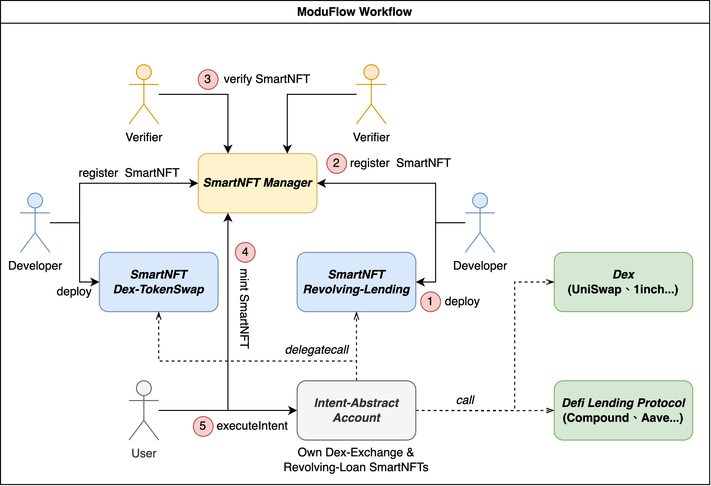

# ModuFlow

A revolutionary intent-centricsolution based on [EIP-7513](https://ethereum-magicians.org/t/eip-7513-intent-abstract-nft/15696) for faster and smarter transactions.

[Pitch Deck](https://docs.google.com/presentation/d/187g6NtSOoJaSUqywL-HdGhZJJAkXohhq/edit?usp=share_link&ouid=117825240711596517538&rtpof=true&sd=true)

[Demo Video](https://youtu.be/QbjN5Qr4HrM)

## Overview

ModuFlow is an innovative intent-centric solution based on [EIP-7513](https://ethereum-magicians.org/t/eip-7513-intent-abstract-nft/15696) that enables the modularization of complex on-chain operations into SmartNFTs.

Users can simply express their intentions, and AI analyzes and interprets their intent. It then selects the most suitable modular functional modules from the market, combines and runs them to fulfill the user's intent.

## Demo Implementation

A complete SmartNFT goes through several processes from deployment to user utilization:

1. A developer deploys the SmartNFT.
2. The developer registers it on SmartManager.
3. Validators provide verification proof to SmartManager.
4. A user obtains an Intent-Abstract Account.
5. The user mints the required SmartNFTs to their Intent-Abstract Account through SmartManager.
6. Users use their Intent-Abstract Account to combine and call SmartNFTs to perform the intended operations.



The frontend demo mainly focuses on the last two steps in the presentation. The previous steps have also been implemented in the simplest form, with corresponding transaction hashes for the operations.

In this demo, we provide two different examples of SmartNFTs. The first one has a token swap function. This SmartNFT calls UniSwap to convert tokens in the Intent-Abstract Account into a specified target token (e.g., USDT). The second one offers a revolving lending feature. This SmartNFT interacts with Aave to perform the specified number of collateralized borrowing operations on the target token in the Intent-Abstract Account (e.g., USDT). Both of these SmartNFTs can be used individually. Additionally, we provide a scenario for combining these two SmartNFTs, allowing users to sequentially convert different tokens into USDT and then engage in the revolving lending process in a single transaction.

## Demo Contracts & Transactions

### Contracts

```js
SmartManager: 0x218c2059d45717286ecc7c09b21ed17752c686e1;

AccessCollenctionSmartNFT: 0x0ce31a2a55b96172b2ca2e7f9900dc2701393a33;

RevolvingLendingSmartNFT: 0x42b599479aafa2b56c57e051f5878126b392dae6;

IntentAbstractAccount: 0xd1ff5a9307b7d702f8f4806203ca1fc514ef994f;
```

### Register Transactions

```js
Register AccessCollenctionSmartNFT:

Register RevolvingLendingSmartNFT:
```

### Mint Access Right Transactions

```js
Mint AccessCollenctionSmartNFT:

Mint RevolvingLendingSmartNFT:
```

### Intent Operation Transactions

```js
Single AccessCollenction:

Single RevolvingLending:

Combination of AccessCollenction & RevolvingLending:
```
